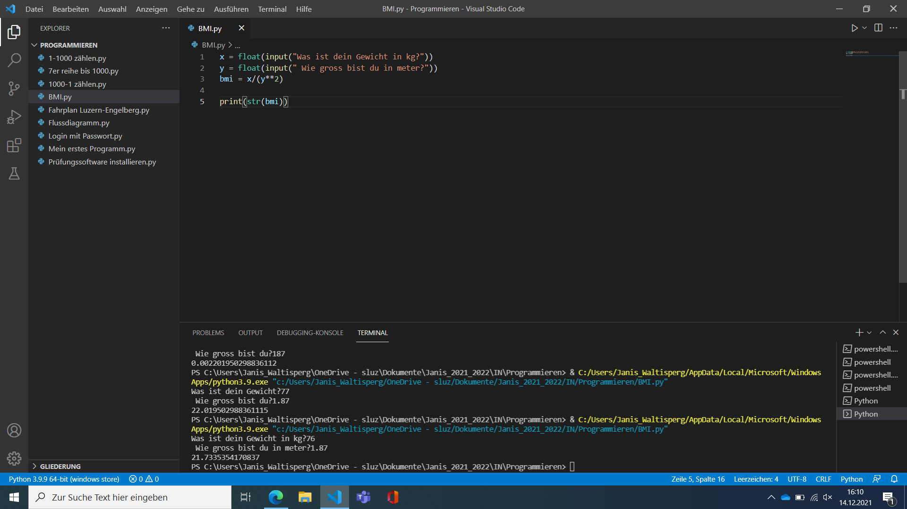

# BMI Rechner

## Was macht der BMI und wie wird er benutzt?
Der BMI gilt lange als Mass, um zu ermitteln, ob eine Person unter-, normal- oder übergewichtig ist.
Man rechnet man rechnet das Körpergewicht (kg) geteilt durch die Körpergrösse (m) im Quadrat.
Dieser Index setzt die Körpergröße in Relation zum Körpergewicht und macht somit mithilfe des ermittelten Werts eine Aussage über das eigene Gewicht.

## Was macht das Features?
- brechnet den BMI
- ob man unter-, normal- oder übergewichtig ist
- Gewicht (kg) : Grösse (m) im Quadrat = BMI

## Was haben ich in den letzten Wochen gelernt und was nehme ich mit?
- Wie man einfachen Programme in Visual Studio Code erstellen kann. 
- Die Programmiersprache Python.
- Das es nicht sehr schwierig ist verschiedene Formlen oder Berechnungen auf Vs Code zu machen ist.
